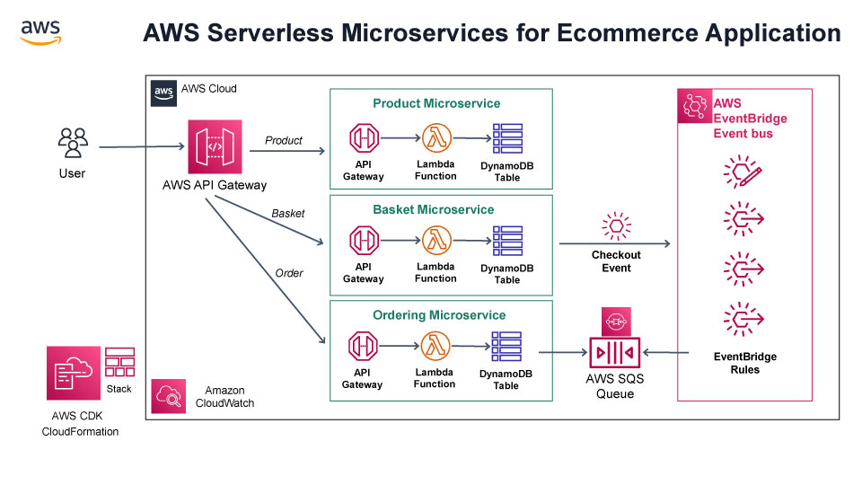

# AWS Serverless Microsservice E-commerce Project Guide

This is the complete documentation for an event driven Serverless Microservices project with using AWS Lambda, Api Gateway, Event Bridge, SQS, DynamoDB and CDK for IaC.

## Prerequisites and installation

See README.md

## Whats Included In This Repository

We will be following the reference architecture above which is a real-world **Serverless E-commerce application** and it includes;

* **REST API** and **CRUD** endpoints with using **AWS Lambda, API Gateway**
* **Data persistence** with using **AWS DynamoDB**
* **Decouple microservices** with events using **Amazon EventBridge**
* **Message Queues** for cross-service communication using **AWS SQS**
* **Cloud stack development** with **IaC** using **AWS CloudFormation and AWS CDK**



[AWS Icons can be found here](https://aws.amazon.com/pt/architecture/icons/)

## File Structure

Monorepo with microservices and infrastructure part

```sh
├── bin
├── src
│   ├── basket
│   ├── ordering
│   ├── product
├── lib
│   ├── apigateway.ts
│   ├── aws-microservices-stack.ts
│   ├── database.ts
│   ├── microservice.ts
│   └── queue.ts
├── cdk.json
├── node_modules
├── package.json
├── package-lock.json
└── .gitignore
```

* cdk.json: tells the CDK Toolkit how to execute your app.
* src folder: Microservices development codes with. Lambda Functions Developed in Nodejs using AWS SDK for JavaScript v3.
* lib folder: Infrastructure codes. Serverless Infrastructure Development, IaC (infrastructure as code) with AWS CDK using Typescript language.
* bin folder: generated by aws cdk. Starting point of our application.
* lib/aws-microservices-stack.ts: begin of the Iac.

## Constructs

[Constructs](https://www.npmjs.com/package/constructs)

Constructs are classes which define a "piece of system state". Constructs can be composed together to form higher-level building blocks which represent more complex state.

Constructs are often used to represent the desired state of cloud applications. For example, in the AWS CDK, which is used to define the desired state for AWS infrastructure using CloudFormation, the lowest-level construct represents a resource definition in a CloudFormation template. These resources are composed to represent higher-level logical units of a cloud application, etc.

## Iac (lib folder)

### lib/microservices.ts

This file contains [Node.js Lambda functions](https://docs.aws.amazon.com/cdk/api/v1/docs/@aws-cdk_aws-lambda-nodejs.NodejsFunction.html)

[AWS Lambda](https://docs.aws.amazon.com/lambda/latest/dg/welcome.html) is a compute service that lets you run code without provisioning or managing servers.

they 'glue' the code in src folder with DynamoDB and API gateway.

### lib/apigateway.ts

This file uses [LambdaRestApi](https://docs.aws.amazon.com/cdk/api/v2/docs/aws-cdk-lib.aws_apigateway.LambdaRestApi.html) to define the API Gateway REST API with AWS Lambda proxy integration. It defines the entry ponint for all microservices.

[Amazon API Gateway](https://aws.amazon.com/api-gateway) is a fully managed service that makes it easy for developers to create, publish, maintain, monitor, and secure APIs at any scale. APIs act as the "front door" for applications to access data, business logic, or functionality from your backend services. Using API Gateway, you can create RESTful APIs and WebSocket APIs that enable real-time two-way communication applications. API Gateway supports containerized and serverless workloads, as well as web applications.

### lib/database.ts

DynamoDb Table Creations for basket, ordering and product microservices.

[DynamoDb](https://aws.amazon.com/dynamodb/) is Fast, flexible NoSQL database service for single-digit millisecond performance at any scale.

### lib/queue.ts

This file uses [Amazon SQS](https://aws.amazon.com/sqs) Fully managed message queuing for microservices, distributed systems, and serverless applications. The queue is used when a checkout event happens and the basket microservice sends the order for further processing at the ordering microservice.

### lib/eventbus.ts

This file uses [Amazon EventBridge](https://docs.aws.amazon.com/cdk/api/v2/docs/aws-cdk-lib.aws_events-readme.html) to delivers a near real-time stream of system events that describe changes in AWS resources.

## Microservices (src folder)

### product

Products microservice folder. The index.js contains an node.js function that will run by the corresponding lambda to handle all api calls related to products.

### basket

Basket microservice folder. The index.js contains an node.js function that will run by the corresponding lambda to handle all api calls related to basket.

### ordering

Orders microservice folder. The index.js contains an node.js function that will watch for events checkout events.
