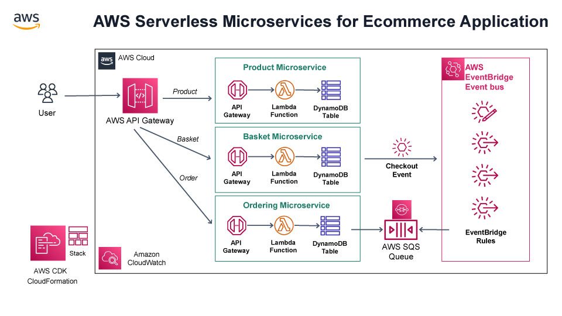

# AWS Serverless Microsservice E-commerce


This is a Serverless Event-driven E-commerce project for TypeScript development with CDK (Cloud Development Kit).

## Complete project documentation

You can read the complete documentation in [DEVELOPMENT.md](/DEVELOPMENT.md) file

## Whats Including In This Repository

We will be following the reference architecture above which is a real-world **Serverless E-commerce application** and it includes;

* **REST API** and **CRUD** endpoints with using **AWS Lambda, API Gateway**
* **Data persistence** with using **AWS DynamoDB**
* **Decouple microservices** with events using **Amazon EventBridge**
* **Message Queues** for cross-service communication using **AWS SQS**
* **Cloud stack development** with **IaC** using **AWS CloudFormation and AWS CDK**



[AWS Icons can be found here](https://aws.amazon.com/pt/architecture/icons/)

## Prerequisites

You will need the following tools:

* AWS Account and User
* AWS CLI
* NodeJS
* AWS CDK Toolkit
* Docker

[AWS Client](https://docs.aws.amazon.com/cli/latest/userguide/getting-started-install.html)
[AWS CDK](https://aws.amazon.com/pt/getting-started/guides/setup-cdk/module-two/)
[Node.js](https://nodejs.org/en)
[Typescript](https://www.typescriptlang.org/download)
[Docker](https://docker.com)

### AWS Cli installation

```sh
curl "https://awscli.amazonaws.com/awscli-exe-linux-x86_64.zip" -o "awscliv2.zip"
unzip awscliv2.zip
sudo ./aws/install
```

### Configure AWS Client

```sh
aws configure
```

### AWS CDK installation

```sh
npm i -g aws-cdk
```

### Typescript installation

```sh
npm i -g typescript
```

### Check versions

```sh
aws --version
node --version
cdk --version
npm --version
```

### Run The Project

Follow these steps to get your development environment set up: (Before Run Start the Docker Desktop)

1. Clone the repository
2. At the root directory which include **cdk.json** files, run below command:

```sh
cdk deploy
```

>Note: Make sure that your Docker Desktop is running before execute the cdk deploy command.

4. Wait for provision all microservices into aws cloud. That’s it!

5. You can **launch microservices** as below urls:

* **Product API -> <https://xxx.execute-api.ap-southeast-1.amazonaws.com/prod/product>**
* **Basket API -> <https://xxx.execute-api.ap-southeast-1.amazonaws.com/prod/basket>**
* **Ordering API -> <https://xxx.execute-api.ap-southeast-1.amazonaws.com/prod/order>**

## Useful commands

* `npm run build`   compile typescript to js
* `npm run watch`   watch for changes and compile
* `npm run test`    perform the jest unit tests
* `cdk deploy`      deploy this stack to your default AWS account/region
* `cdk diff`        compare deployed stack with current state
* `cdk synth`       emits the synthesized CloudFormation template

## Best practices for developing and deploying cloud infrastructure with the AWS CDK

<https://docs.aws.amazon.com/cdk/v2/guide/best-practices.html>

With the AWS CDK, developers or administrators can define their cloud infrastructure by using a supported programming language. CDK applications should be organized into logical units, such as API, database, and monitoring resources, and optionally have a pipeline for automated deployments. The logical units should be implemented as constructs including the following:

* Infrastructure (such as Amazon S3 buckets, Amazon RDS databases, or an Amazon VPC network)
* Runtime code (such as AWS Lambda functions)
* Configuration code

## CDK Toolkit commands

<https://docs.aws.amazon.com/cdk/v2/guide/cli.html>

The AWS CDK Toolkit, the CLI command cdk, is the primary tool for interacting with your AWS CDK app. It executes your app, interrogates the application model you defined, and produces and deploys the AWS CloudFormation templates generated by the AWS CDK. It also provides other features useful for creating and working with AWS CDK projects. This topic contains information about common use cases of the CDK Toolkit.

| Command  | Function |
| -------------- | ------------------------------------------------------------------- |
| cdk list (ls)  | Lists the stacks in the app  |
| cdk synthesize (synth) | Synthesizes and prints the CloudFormation template for one or more specified stacks |
| cdk bootstrap | Deploys the CDK Toolkit staging stack; see Bootstrapping |
| cdk deploy | Deploys one or more specified stacks |
| cdk destroy | Destroys one or more specified stacks |
| cdk diff | Compares the specified stack and its dependencies with the deployed stacks or a local CloudFormation template |
| cdk metadata | Displays metadata about the specified stack |
| cdk init | Creates a new CDK project in the current directory from a specified template |
| cdk context | Manages cached context values |
| cdk docs (doc) | Opens the CDK API Reference in your browser |
| cdk doctor | Checks your CDK project for potential problems |

## AWS Toolkit for Visual Studio Code

<https://aws.amazon.com/pt/visualstudiocode/>

The AWS Toolkit for Visual Studio Code is an open source plug-in for the Visual Studio Code that makes it easier to create, debug, and deploy applications on Amazon Web Services. With the AWS Toolkit for Visual Studio Code, you will be able to get started faster and be more productive when building applications with Visual Studio Code on AWS. The toolkit provides an integrated experience for developing serverless applications, including assistance for getting started, ML-powered code recommendations, step-through debugging, and deploying from the IDE.

## Bootstrapping your AWS environment

<https://docs.aws.amazon.com/cdk/v2/guide/bootstrapping.html>

Bootstrapping is the process of provisioning resources for the AWS CDK before you can deploy AWS CDK apps into an AWS environment. (An AWS environment is a combination of an AWS account and Region).

Deploying stacks with the CDK requires special dedicated AWS CDK resources to be provisioned. The cdk bootstrap command creates the necessary resources for you. You only need to bootstrap if you are deploying a stack that requires these dedicated resources.

```sh
cdk bootstrap
```

If issued with no arguments, as shown here, the cdk bootstrap command synthesizes the current app and bootstraps the environments its stacks will be deployed to. If the app contains environment-agnostic stacks, which don't explicitly specify an environment, the default account and Region are bootstrapped, or the environment specified using --profile.

## Deploying stacks

The cdk deploy subcommand deploys one or more specified stacks to your AWS account.

```sh
cdk deploy        # if app contains only one stack
cdk deploy MyStack
cdk deploy Stack1 Stack2
cdk deploy "*"    # all stacks in app
```

## Clean up resources

_"Turn of the lights before leaving the room"_
**Werner Vogels**
Amazon CTO

The AWS CDK attempts to keep you from losing data by defaulting to policies that **retain everything you create**. For example, the default removal policy on resources that contain data (such as Amazon S3 buckets and database tables) is **not to delete the resource when it is removed from the stack**. Instead, the resource is orphaned from the stack. Similarly, the CDK's default is to retain all logs forever. In production environments, these defaults can quickly result in the storage of large amounts of data that you don't actually need, and a corresponding AWS bill.

Consider carefully what you want these policies to be for each production resource and specify them accordingly. Use Aspects to validate the removal and logging policies in your stack.

```sh
cdk destroy
```

## CDK Patterns

<https://cdkpatterns.com/>

show available templates with:

```sh
cdk init --list
```

init a template (be carefull because it will create a new project simmilar to this one):

```sh
cdk init sample-app --language=typescript
```

## License

This project is licensed under the MIT License - see the [LICENSE.md](LICENSE.md) file for more information.
